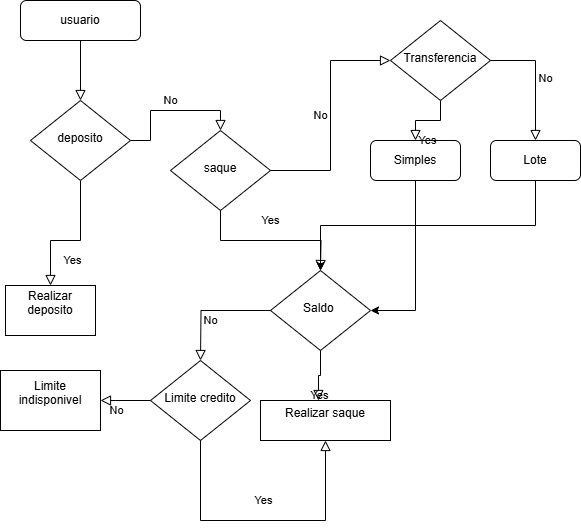
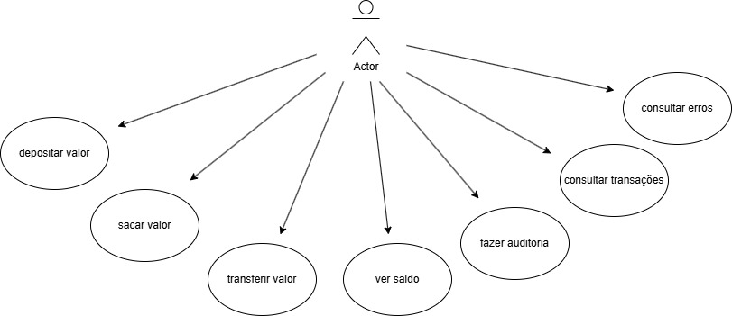
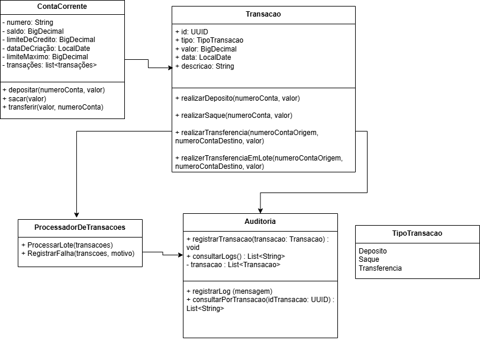

# DesfioBanco
Repositório para o desafio técnico, feito em java 23. O objetivo do projeto é criar um sistema de conta corrente operacional.
As funcionalidades do sistema são:
- Criar uma conta corrente
- Depositar
- Sacar
- Transferir
- Transferencias em lote
- Consultar transações

## Tecnologias utilizadas
- Java 23
- Spring Boot
- JPA
- MySQL
- Hibernate

## Fluxograma 



## Caso de Uso



## Diagrama de Classes



## Como executar o projeto

 1. Clonar o repositório
 2. Importar o projeto para Ide ou Eclipse
 3. Configurar o Banco de dados MySQL 
 4. Criar a database com o nome "BancoMagalu" 
 5. Configurar o arquivo application.properties
 6. executar o projeto com o comando "mvn spring-boot:run" ou no IDE de sua preferência.

## Rotas da API

### Criar uma conta corrente
Post:
```
localhost:8080/conta-corrente
```
Body: 
```
{
    "numero": "54321",
    "saldo": 1000.00,
    "limiteCredito": 500.00,
    "dataDeCriacao": "2024-11-19"
}
```

### Buscar uma conta corrente
Get:
```
localhost:8080/conta-corrente/{numero}
```

### Atualizar saldo de uma conta corrente
Patch:
```
localhost:8080/conta-corrente/12345/atualizar-saldo?saldo=2000.00
```

### Depositar
Post:
```
localhost:8080/transacao/deposito
```
Body: 
```
{
"numeroConta" : 12345,
"valor":5010.00
}
```

### Sacar
Post:
```
localhost:8080/transacao/saque
```
Body: 
```
{
"numeroConta" : 12345,
"valor":1200.00
}
```

### Transferir
Post:
```
localhost:8080/transacao/transferencia
```
Body: 
```
{
    "contaOrigem" : 12345,
    "contaDestino" : 12,
    "valor":200.00
}
```

### Transferencias em lote
post:
```
localhost:8080/transacao/lote
```
Body: 
```
{
  "transferencias": [
    {
      "contaOrigem": "12345",
      "contaDestino": "54321",
      "valor": 100.00
    },
    {
      "contaOrigem": "67890",
      "contaDestino": "98765",
      "valor": 200.00
    }
  ]
}
```

### Consultar transações
Get:
```
localhost:8080/auditoria/{numeroConta}  
``` 

## Autor

William Maich Kolosque


